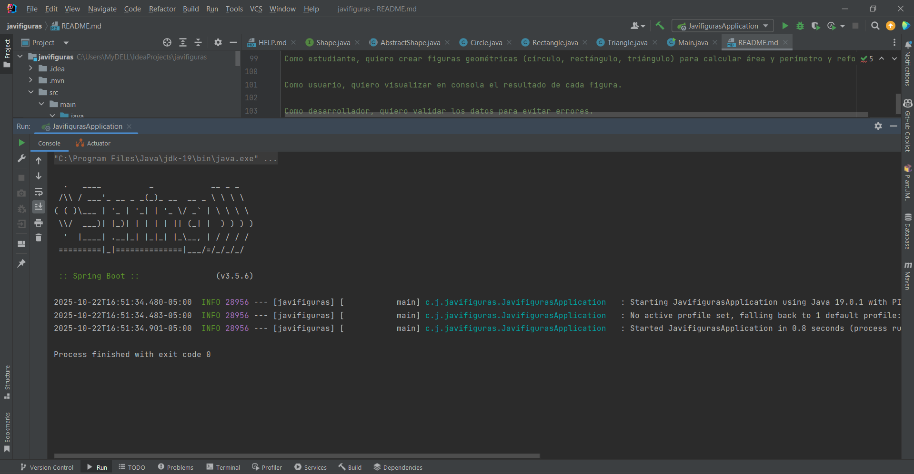

# javifiguras

Modelado de figuras geométricas en **Java** aplicando **POO**: interfaz, abstracción, herencia y polimorfismo.  
Proyecto listo para ejecutar y revisar en **IntelliJ IDEA**.

## 🎯 Objetivos
- Definir **interfaces y métodos comunes** (`Shape`).
- Crear una **estructura de clases** clara y mantenible.
- Aplicar **abstracción, herencia y polimorfismo**.
- Validar **invariantes** (valores positivos y regla del triángulo).
- Documentar con **diagrama de clases** y **historias de usuario**.

## 📦 Estructura (src/main/java/com/javi/javifiguras)
AbstractShape.java // Clase base abstracta (nombre + validaciones)  
Circle.java // Círculo: área y perímetro  
Rectangle.java // Rectángulo: área y perímetro  
Triangle.java // Triángulo: Herón + validación de lados  
Shape.java // Interfaz común (name, area, perimeter, draw)  
Main.java // Demostración (lista polimórfica)

---

## 🧪 Cómo ejecutar
1. Abre el proyecto en IntelliJ IDEA.
2. Ve a `Main.java`.
3. Haz clic en ▶️ **Run**.

**Salida esperada (ejemplo):**  
=== Figuras ===  
Dibujando Círculo (r=3.0): ooo  
Círculo -> Área: 28.27, Perímetro: 18.85  
Dibujando Rectángulo (4.0x6.0): ▭  
Rectángulo -> Área: 24.00, Perímetro: 20.00  
Dibujando Triángulo (3.0, 4.0, 5.0): ▲  
Triángulo -> Área: 6.00, Perímetro: 12.00

---

## 🧠 Conceptos aplicados
- **Interfaz** (`Shape`): define los métodos comunes para todas las figuras.
- **Abstracción** (`AbstractShape`): centraliza validaciones y nombre.
- **Herencia**: cada figura extiende `AbstractShape`.
- **Polimorfismo**: la lista `List<Shape>` ejecuta métodos específicos según la figura.
- **Encapsulamiento**: todos los atributos son privados.

---

## 📘 Historias de usuario
- Como estudiante, quiero crear figuras geométricas (círculo, rectángulo, triángulo) para calcular área y perímetro y reforzar POO.  
- Como usuario, quiero visualizar en consola el resultado de cada figura.  
- Como desarrollador, quiero validar los datos para evitar errores.  
- Como profesor, quiero revisar el diagrama de clases para verificar herencia y polimorfismo.  
- Como alumno, quiero poder agregar nuevas figuras sin modificar las existentes.

---

## 📸 Evidencia de ejecución


---

## 🧩 Diagrama de clases

```mermaid
classDiagram
    class Shape {
        <<interface>>
        +getName(): String
        +area(): double
        +perimeter(): double
        +draw(): void
    }

    class AbstractShape {
        <<abstract>>
        -name: String
        +getName(): String
        #validatePositive(values: double...)
    }

    class Circle {
        -radius: double
        +area(): double
        +perimeter(): double
        +draw(): void
    }

    class Rectangle {
        -width: double
        -height: double
        +area(): double
        +perimeter(): double
        +draw(): void
    }

    class Triangle {
        -a: double
        -b: double
        -c: double
        +area(): double
        +perimeter(): double
        +draw(): void
    }

    Shape <|.. AbstractShape
    AbstractShape <|-- Circle
    AbstractShape <|-- Rectangle
    AbstractShape <|-- Triangle
